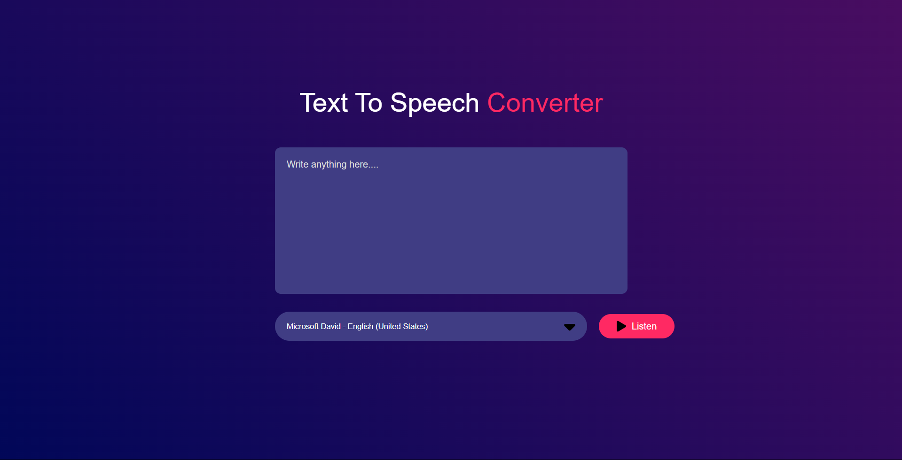
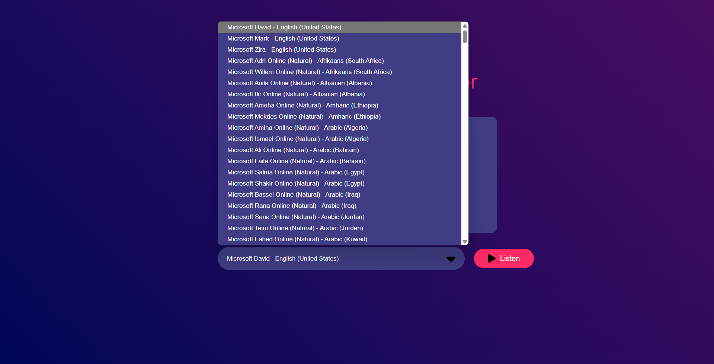

# Text-to-Speech Converter

A text-to-speech converter supporting more than 100 languages, built using HTML, CSS, and JavaScript.

[Live Demo](https://sensational-stardust-d64f20.netlify.app/)

---

## Overview
This project demonstrates:
- Conversion of text input into speech output in multiple languages.
- User-friendly interface for selecting languages and controlling playback.
- Simple and responsive design adaptable to all screen sizes.

---

## Features
- **Multi-Language Support:** Over 100 languages available for text-to-speech conversion.
- **Playback Controls:** Start, pause, and stop options for flexibility.
- **Responsive Design:** Optimized for desktops, tablets, and mobile devices.
- **Interactive UI:** Easy-to-use interface for seamless operation.

---

## Technologies Used

### Frontend
- **HTML5:** Structured content.
- **CSS3:** Styling and responsive design.
- **JavaScript:** Adds interactivity and API integration.

### Hosting
- Hosted on Netlify: [Live Demo](https://sensational-stardust-d64f20.netlify.app/)

---

## Installation

### Steps
1. Clone the repository:
   ```bash
   git clone https://github.com/shubham-jaishu/Text_To_Speech.git
   ```

2. Navigate to the project directory:
   ```bash
   cd Text_To_Speech
   ```

3. Open the `index.html` file in your browser:
   ```bash
   open index.html
   ```

---

## How It Works
1. **Text Input:** Enter text in the input field.
2. **Language Selection:** Choose from a dropdown list of supported languages.
3. **Playback Control:** Play, pause, or stop speech output as needed.

---

## Preview



---

## Future Improvements
- Add voice modulation features such as pitch and speed adjustments.
- Implement offline support for selected languages.
- Save and export audio output files.

---

## Contribution
Contributions are welcome! Feel free to fork the repository and submit a pull request.

---

## Contact
For queries or feedback, please contact [Shubham](mailto:shubhamjaishu@gmail.com).
